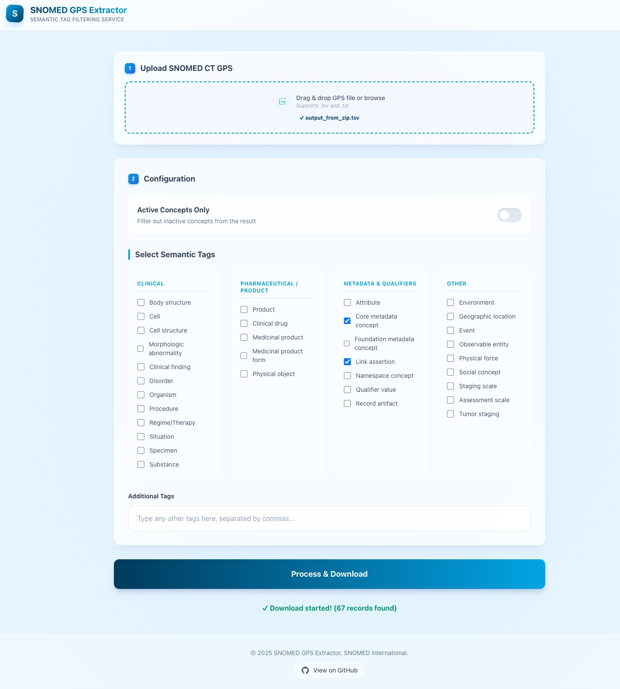

# SNOMED CT GPS Extractor

A powerful utility tool for extracting and processing SNOMED CT terminology data from an RF2 release. It produces the SNOMED International GPS (Global Patient Set) format and offers advanced filtering capabilities via both a command-line interface (CLI) and a modern web interface.

You can also download the published GPS directly from SNOMED International - https://www.snomed.org/gps.

## Features

*   [**Term Extraction**](#GPS-file-creation): Extracts concepts and terms from SNOMED CT RF2 release files into a simplified TSV format (ID, Active Status, FSN, Term).
*   [**Semantic Tag Filtering**](#semantic-tag-filtering): Filter the extracted data based on SNOMED CT semantic tags (e.g., "disorder", "finding", "substance").
*   [**Web Interface**](#web-interface-recommended): A user-friendly web UI — [runs directly in your browser](https://ihtsdo.github.io/snomed-gps-extractor/) with no installation needed.
*   **Active Concept Filtering**: Optionally filter to include only active concepts.
*   [**Output Validation**](#validating-a-gps-extraction): Cross-reference a GPS file against its source RF2 release to verify concept counts, FSNs, preferred terms, and active flags.
*   **CLI Support**: Robust command-line tools for automation and batch processing.

## Prerequisites

These are the prerequisites for running the extractor software locally.

*   **Java Runtime Environment (JRE)**: Version 17 or higher.
*   **Maven**: For building the project.
*   **SNOMED CT Release Files**: You will need the standard RF2 release files (Concepts, Descriptions, and Language Preferences) or the full release ZIP.

## Installation

Clone the repository and build the project using Maven:

```bash
git clone https://github.com/IHTSDO/snomed-gps-extractor.git
cd snomed-gps-extractor
mvn clean package
```

This will create an executable JAR file in the `target` directory (e.g., `snomed-gps-extractor*.jar`).


## SNOMED CT GPS file creation

Extract raw terms from SNOMED CT RF2 files to create a GPS-compatible TSV file.

### Using SNOMED CT RF2 Release ZIP file
```bash
java -jar target/snomed-gps-extractor*.jar extract-terms [--active-only] [--inactive-since YYYYMMDD] <rf2-zip-file> <output-file>
```

*   `--active-only`: (Optional) If set, only active concepts are extracted. Default is all concepts.
*   `--inactive-since YYYYMMDD`: (Optional) Only include inactive concepts whose effective date is on or after the given date. Active concepts are always included regardless. This is useful for excluding concepts that were inactivated before a certain release.

## Semantic Tag Filtering

### Web Interface (Recommended)

The easiest way to filter your GPS data is using the web interface. No installation required — it runs entirely in your browser.

**[Open the Web Interface](https://ihtsdo.github.io/snomed-gps-extractor/)**



Your file is processed locally in the browser and is never uploaded to any server.

1.  **Upload**: Drag and drop your SNOMED CT GPS file (TSV format).
2.  **Configure**:
    *   Toggle **"Active Concepts Only"** to exclude inactive records.
    *   Select the desired **Semantic Tags** from the categorized list.
    *   Add any **Custom Tags** if needed.
3.  **Process**: Click "Process & Download" to get your filtered dataset.

### Command line

Filter an existing GPS TSV file by semantic tags using the command line.

```bash
java -jar target/snomed-gps-extractor*.jar extract-tags [--active-only] <input-file> <tag1> [tag2 ...]
```

*   `--active-only`: (Optional) Filter for active concepts only.
*   `input-file`: The GPS file to filter.
*   `tag`: One or more semantic tags (e.g., "disorder", "body structure").

## Validating a GPS Extraction

After producing a GPS file, use the `validate` command to cross-reference it against the RF2 release it was extracted from. The tool independently re-reads the three source RF2 files to build a ground-truth oracle, then checks every row of the GPS output against it.

```bash
java -jar target/snomed-gps-extractor*.jar validate \
    [--active-only] [--inactive-since YYYYMMDD] \
    <rf2-zip-file> <gps-output-tsv> <report-file>
```

Pass the same filter flags (`--active-only`, `--inactive-since`) that were used during extraction so the oracle applies the same concept selection rules.

**Example:**
```bash
java -jar target/snomed-gps-extractor*.jar validate \
    --inactive-since 20230101 \
    SnomedCT_Release_INT_20260101.zip \
    gps_output.tsv \
    validation_report.txt
```

The report lists the checks performed, the concept count from the source, the number of violations found, an overall PASS/FAIL result, and — if any violations were found — a numbered list describing each one.

**Checks performed:**

| # | Check |
|---|-------|
| 1 | Output file header is exactly: `id \| active \| fsn \| term` |
| 2 | Every data row has exactly 4 tab-separated columns |
| 3 | No concept ID appears more than once in the output |
| 4 | Every concept in the source RF2 (after applying filter flags) is present in the output |
| 5 | No concept appears in the output that is absent from the source RF2 or was filtered out |
| 6 | The `active` flag on each row matches the source concept file |
| 7 | The FSN on each row is the active FSN from the source descriptions file |
| 8 | The preferred term on each row is the active Preferred synonym per the language refset |
| 9 | Every non-empty FSN ends with a parenthesised semantic tag, e.g. `(disorder)` |

## File Formats

### Output Format (GPS)
The tool produces a Tab-Separated Values (TSV) file with the following columns:

| id | active | fsn | term |
|----|--------|-----|------|
| 73211009 | 1 | Diabetes mellitus (disorder) | Diabetes mellitus |
| 101009 | 0 | Inactive concept (disorder) | Inactive concept |

## License

Apache License, Version 2.0. See [LICENSE](LICENSE) for details.

---
&copy; 2025 SNOMED International.
